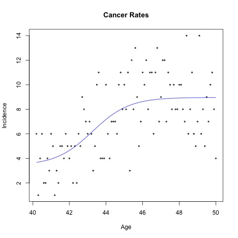

---
title: "Quick_Start with the changeS Package"
output:
   rmarkdown::html_vignette
vignette: >
  %\VignetteIndexEntry{Quick_Start}
  %\VignetteEngine{knitr::rmarkdown}
  \usepackage[utf8]{inputenc}
---

```{r, include = FALSE}
knitr::opts_chunk$set(
  collapse = TRUE,
  comment = "#>"
)
```

**An S-Curve Method for Estimating Abrupt and Gradual Changepoints**

# Using This Document for a Quick Introduction to the Package

Reading through the first example ("Nile River Data") is
sufficient for a quick start.

# What This Package Does

The code here implements the method of Jiang *et al* (2023), whch
does changepoint detection/estimation for changes in mean,
performed by using an S-curve (logistic function) to approximate a step
function.  This enables asymptotic standard errors, and associated
confidence intervals and tests for changepoint locations and change
magnitudes.  Both abrupt and gradual changes may be modeled.  

Also, changes in slope and intercept in piecewise linear models can be
analyzed, again with the ability to form confidence intervals for the
various quantities of interest..

# Example: Nile River data

The **Nile** dataset, built-in to R, consists of yearly measurements of
the height of the river during 1871-1970.  Here is the code:

``` r
nile <- data.frame(t=1871:1970, ht=Nile)
nileOut <- fitS(nile,1,2,10)  # abrupt change model
nileOut
# [1] "point estimates of the alpha_i"
#  postMean   preMean  changePt 
#  849.9696 1097.9298 1898.3814 
# [1] "covariance matrix"
#             postMean     preMean    changePt
# postMean 228.8062041   0.7764724  -0.5270315
# preMean    0.7764724 609.8103449 -11.2918541
# changePt  -0.5270315 -11.2918541   6.1601174
# [1] "standard error of the difference between pre-changepoint and post-changepoint means"
# [1] 28.93205
summary(nileOut)
# Formula: y ~ fitGenLogit_fixed(postMean, preMean, changePt, x = x)
# 
# Parameters:
#          Estimate Std. Error t value Pr(>|t|)
# postMean  849.970     15.126   56.19   <2e-16 ***
# preMean  1097.930     24.694   44.46   <2e-16 ***
# changePt 1898.381      2.482  764.87   <2e-16 ***
# ---
# Signif. codes:  0 ‘***’ 0.001 ‘**’ 0.01 ‘*’ 0.05 ‘.’ 0.1 ‘ ’ 1
# 
# Residual standard error: 128.3 on 97 degrees of freedom
# 
# Number of iterations to convergence: 10
# Achieved convergence tolerance: 1.49e-08

```

Our model concluded that there is an abrupt changepoint
in the middle of year 1898. This matches the fact that the British
started the construction of the Aswan Low Dam in that year.
We modeled an abrupt change here, by setting the S-curve slope to a
large value, 10.

Here domain expertise would identify the location of the changepoint, so
the main interest is the value of the change.  A major drop of water
flow is detected around this point, from 1097.75 down to 849.972.
An approximate 95% confidence interval for the change in mean would then
be 

849.972 - 1097.75 &plusmn;  1.96 x 28.93205

We can also plot the fit against the raw data:


# Example: Cancer Occurrence Rates

We next consider applying the S-Curve approach to data collected in
on the rates of breast cancer among women in Sweden.  There had been
speculation that such rates rise with the onset of menopause; see
Pawitan (2005; we are grateful to Prof. Pawitan for making his data
available.

While that paper considers an abrupt model, the relationship, if one
exists, may be gradual.  For a given woman the transition to menopause
is gradual.  And even if it were abrupt, different women experience
menopause at different ages, so that the data would follow a mixture of
abrupt changes, hence gradual overall.  Thus this is a good example use
case for our S-curve approach.

``` r
data(cancerRates)
crOut <- fitS(cancerRates,1,2)
crOut
# [1] "point estimates of the alpha_i"
#  postMean   preMean     slope  changePt 
#  8.965952  3.425623  1.178302 43.262817 
# [1] "covariance matrix"
#             postMean    preMean      slope   changePt
# postMean  0.16734502 -0.1215118 -0.1318708 0.02302526
# preMean  -0.12151178  1.1340273  0.5080011 0.44335717
# slope    -0.13187077  0.5080011  0.4107214 0.16400967
# changePt  0.02302526  0.4433572  0.1640097 0.29987282
# [1] "standard error of the difference between pre-changepoint and post-changepoint means"
# [1] 1.242737

```

Here we did not specify an S-curve slope, asking **fitS** to estimate it
for us.  This models a gradual change.

We can plot the output:

``` r
plot(crOut)
```



# Example: piecewise linear model

This dataset came from a study that investigated the impact of Medicare,
the US medical insurance program for retired people.  One nomimally
qualifies at age 65, though this can occur earlier or later.  Here we
consider 90-day mortality in relation to age.

``` r
data(medicare)
z <- fitS_linear(medicare[,c(4,3)],1,2)
summary(z)
# Formula: y ~ big_linear_guy(b1, h1, s1, c, b2, h2, s2, x = x)
# 
# Parameters:
#     Estimate Std. Error t value Pr(>|t|)    
# b1   0.60490    0.07135   8.478 9.87e-14 ***
# h1   0.78810    0.18587   4.240 4.59e-05 ***
# s1   9.59339  717.41168   0.013  0.98935    
# c   65.99895    0.10660 619.109  < 2e-16 ***
# b2 -23.93643    4.40366  -5.436 3.19e-07 ***
# h2 -37.23297   12.69091  -2.934  0.00406 ** 
# s2   2.89020    1.76829   1.634  0.10495    
# ---
# Signif. codes:  0 ‘***’ 0.001 ‘**’ 0.01 ‘*’ 0.05 ‘.’ 0.1 ‘ ’ 1
# 
# Residual standard error: 0.6417 on 113 degrees of freedom
# 
# Number of iterations to convergence: 91 
# Achieved convergence tolerance: 1.49e-08
vcov(z)  # estimated covariance matrix
#              b1           h1           c          b2          h2
# b1  0.005757223 -0.001619101  -0.2452871 -0.35465289   0.1101008
# h1 -0.001619101  0.004669711   0.1776810  0.09876255  -0.3140773
# c  -0.245287074  0.177681049  26.4532915 14.96270436 -12.0819248
# b2 -0.354652894  0.098762545  14.9627044 21.85540725  -6.7159704
# h2  0.110100783 -0.314077292 -12.0819248 -6.71597037  21.1321480
```

As we would hope, mortality did decline after people became eligible for
Medicare.  For instance, the intercept went down from -23.9364322 to
-37.2329709.  Interestingly, the changepoint is close to 66, indicating
that many people opted to start the program a little later.

An approximate 95% confidence interval for the location of the
changepoint is 65.99895 &plusmn; 1.96 x  0.10660. 


# Comparison to Other Packages

There are many R packages for determining changepoints. We will mentipn
two here for comparison to **changeS**, the **changepoints** and **mcp**
packages.

* Types of changes

    - **changeS** package is the only one of the three to handle both 
    abrupt and gradual changes; 

    - the other two model only the abrupt case.

* Changepoint location domain 

    -  **changepoints** assumes that the location of a changepoint
       is an integer

    - **changeS** and **mcp** assume the location is a general
      continuous number

* Statistical basis

    - **changepoints** offers several different methods, but the
      general theme is to conduct a series of statistical hypothesis tests at
      various candiate integer locations  

    - **changeS** uses nonlinear least-squares estimation

    - **mcp** takes the Bayesian estimation philosophy

* Uncertainty analysis: changepoint locations and magnitudes

    - **changepoints** does not form confidence intervals for these
       quantities

    - **changeS** offers confidence intervals

    - **mcp** offers Bayesian credible intervals


# References

An S-Curve Method for Abrupt and Gradual Changepoint Analysis, Lan
Jiang, Collin Kennedy, Norman Matloff;  SDSS 2023

*Encyclopedia of Biostatistics*, Change-point Problem Yudi Pawitan,
2005, https://doi.org/10.1002/0470011815.b2a12011
